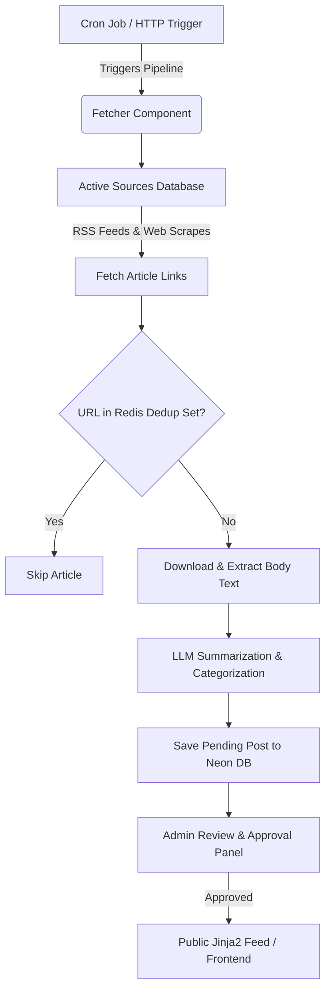

# ⚡ RAPID NEWS

[](https://www.python.org/)
[](https://www.djangoproject.com/)
[](https://tailwindcss.com/)
[](https://docs.celeryq.dev/)
[](https://www.docker.com/)

**RAPID NEWS** is an automated, AI-driven technology and machine learning news aggregation platform. It orchestrates background scraping, deduplicates incoming articles, extracts full content, and leverages advanced Large Language Models (LLMs) to synthesize structured metadata and concise summaries—all served through a high-performance web interface.

---

## 🏗️ Architecture Flow

The pipeline is designed to be fully synchronous at the task level and managed asynchronously via Celery. Here is how articles flow through the system:



---

## ⚡ Key Highlights

*   **Smart Parsing & Scraping**: Uses `feedparser`, `beautifulsoup4`, and `newspaper3k` to retrieve article titles, metadata, and body text.
*   **Redis-Powered Deduplication**: Instant SHA-256 URL hashing stored in Redis to guarantee no processing overhead on duplicate links.
*   **Intelligent AI Summarization**: Sends extracted clean texts to OpenAI models (or custom local setups like Qwen via vLLM/Ollama) to extract:
    *   *Categorization* (assigns tags like LLMs, Computer Vision, Robotics, Dev Tools, and 6 more)
    *   *Relevance filtering* (validates whether the text is actual tech/AI news)
    *   *Structured summaries* and author attribution
*   **Modern Serverless Deployment**: Designed to run efficiently on **Fly.io** using a co-located loopback Redis instance. Since the Fly instance automatically scales down when idle to save costs, the system uses an external cron trigger (`POST /internal/trigger-fetch/` secured by a shared `CRON_SECRET`) to wake the server and execute updates.

---

## 🛠️ Quick Setup & Installation

Get your local copy of **RAPID NEWS** up and running in a few simple steps.

### Prerequisites
Make sure you have the following installed on your machine:
*   [Python 3.12+](https://www.python.org/downloads/)
*   [Docker & Docker Compose](https://www.docker.com/products/docker-desktop/) (to run Redis locally)
*   `make` (utility for execution commands)

---

### Step-by-Step Installation

#### 1. Clone the repository and install dependencies
Use the convenience Makefile to install Python dependencies from `requirements.txt`:
```bash
make install
```

#### 2. Configure Environment Variables
Copy the sample `.env.example` file to create your own configuration file:
```bash
cp .env.example .env
```
Open `.env` and fill out the fields:
*   `DATABASE_URL`: Your local/remote PostgreSQL database URL (or SQLite configuration).
*   `REDIS_URL`: Defaults to `redis://localhost:6379/0` (managed via Docker).
*   `OPENAI_API_KEY`: Your OpenAI API key (or compatibility key for Ollama/vLLM).
*   `OPENAI_BASE_URL`: Optional custom base endpoint for local models.
*   `LLM_MODEL`: The LLM to target (e.g., `gpt-4o-mini` or `Qwen/Qwen3.5-4B`).
*   `CRON_SECRET`: A secure random secret key to authorize background fetch updates.

#### 3. Start Redis Container
Start the local Redis server container in detached mode:
```bash
make docker-up
```

#### 4. Setup Database and Seeds
Run Django database migrations and seed the standard AI news sources list:
```bash
# Apply Django migrations
make migrate

# Seed sources (automatically runs during initialization scripts, or manually via:)
python manage.py seed_sources

# Create an administrator superuser to access the /admin review panel
make superuser
```

#### 5. Run the Application Services

To test the system end-to-end, you need to spin up the web server and the Celery worker process.

*   **Start the Django Web Server (Serving Backend & Frontend):**
    ```bash
    make backend
    ```
    The application will be accessible at: `http://127.0.0.1:8000/`

*   **Start the Celery worker (Open a new terminal tab):**
    ```bash
    make worker
    ```

---

## 🛠️ Makefile Command Cheat Sheet

We provide a robust `Makefile` to simplify common development tasks.

| Command | Action Description |
|:---|:---|
| `make install` | Installs requirements from `requirements.txt` |
| `make docker-up` | Starts local Redis container in the background |
| `make docker-down` | Stops the running local Redis container |
| `make migrate` | Applies Django database migrations |
| `make makemigrations` | Detects changes and builds new database migrations |
| `make backend` / `make frontend` | Starts the Django development server |
| `make worker` | Runs the Celery task runner for background fetching |
| `make superuser` | Generates a Django admin superuser account |
| `make test` | Executes the `pytest` test suite |
| `make test-ci` | Runs only unit tests with SQLite (skips integration tests) |
| `make clean` | Wipes the test cache and `__pycache__` directories |

---

## 🏷️ Curated Categories (10 Core Domains)

All articles processed by the extraction engine are automatically tagged with one or more of these core subjects:

1.  **LLMs** (Large language models, GPT, Claude, Gemini, etc.)
2.  **Computer Vision** (Image/video generation, object detection)
3.  **Robotics** (Humanoids, autonomous systems, drones)
4.  **Cloud & Infra** (GPUs, cloud scaling, MLOps, deployment)
5.  **Cybersecurity** (AI security, adversarial ML, vulnerabilities)
6.  **Startups & Funding** (Acquisitions, funding rounds, launches)
7.  **Open Source** (Open-source libraries, models, benchmarks)
8.  **Research** (Academic papers, breakthroughs, laboratory research)
9.  **Developer Tools** (IDEs, APIs, coding assistants, SDKs)
10. **Policy & Ethics** (Safety, governance, bias, regulations)

---

> [!NOTE]
> For deploying to production on Fly.io, reference the configuration files `fly.toml` and the setup guides located inside the [docs/](file:///c:/Programming/Projects/01_ACTIVE/ai_news/docs) directory.
