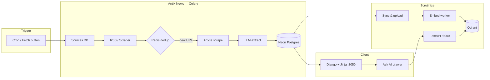

# Antix News

[](https://www.python.org/)
[](https://www.djangoproject.com/)
[](https://docs.celeryq.dev/)
[](https://neon.tech/)
[](https://redis.io/)
[](https://www.docker.com/)

**Antix News** is an AI-powered tech news aggregator. It ingests articles from RSS feeds and scraped sources, deduplicates URLs in Redis, extracts metadata with a local or cloud LLM, and serves a dark-themed reading experience with saved articles, live search, and an **Ask AI** sidebar backed by **Scrutinize** vector search.

---

## Table of contents

- [Features](#features)
- [Architecture](#architecture)
- [Tech stack](#tech-stack)
- [Project structure](#project-structure)
- [Quick start](#quick-start)
- [Running locally (full stack)](#running-locally-full-stack)
- [Environment variables](#environment-variables)
- [Makefile reference](#makefile-reference)
- [Admin panel](#admin-panel)
- [Content taxonomy](#content-taxonomy)
- [Documentation](#documentation)
- [Deployment](#deployment)

---

## Features

### Public frontend (`http://127.0.0.1:8050`)

| Feature | Description |
|---------|-------------|
| **Feed** | Paginated card grid with infinite scroll, tag/source/date filters, and keyword search |
| **Saved** | Token-based portable library — no login required; session stored in `localStorage` |
| **Fetch latest** | Triggers background ingestion, Scrutinize sync, and embedding with live progress UI |
| **Ask AI** | RAG chat drawer powered by Scrutinize — answers with citations from indexed articles |
| **Read more modal** | Expand summaries in-place without leaving the feed |
| **Mobile responsive** | Collapsible nav, stacked cards, full-width chat drawer on small screens |

### Ingestion pipeline

| Stage | What happens |
|-------|----------------|
| **Discovery** | RSS via `feedparser`, or homepage link scraping when no feed exists |
| **RSS-first metadata** | Title, date, summary, and author from the feed when available; LLM fills gaps |
| **Dedup** | SHA-256 URL hash in Redis — duplicates skipped before any scrape/LLM cost |
| **Scrape** | Full article body via `newspaper3k` with `readability-lxml` fallback |
| **Extract** | OpenAI-compatible LLM returns title, summary, tags, validity check |
| **Store** | Approved posts in Neon PostgreSQL with JSON tags and full raw content |
| **Embed** | Recent articles synced to Scrutinize / Qdrant for Ask AI retrieval |

### Admin panel (`/admin/`)

- Password-protected login (PBKDF2-hashed credentials)
- Themed dark UI matching the public site
- Read-only post browser with search and filters
- **Keyword Settings** — featured-article keyword matching
- **LLM Config** — set local LLM base URL and model name from the UI (overrides `.env`)

---

## Architecture

### End-to-end data flow



### Local development topology

```text
┌─────────────────────────────────────────────────────────────┐
│  Docker (make docker-up)                                    │
│  ├── Redis :6379   (DB 0 = Scrutinize, DB 1 = Antix)      │
│  └── Qdrant :6333  (vector store)                           │
└─────────────────────────────────────────────────────────────┘
         │                              │
         ▼                              ▼
┌──────────────────┐          ┌──────────────────┐
│ Scrutinize :8000 │◄─────────│ Antix News :8050 │
│ FastAPI + worker │  sync    │ Django + worker  │
└──────────────────┘          └──────────────────┘
```

---

## Tech stack

| Layer | Technology |
|-------|------------|
| Web framework | Django 5, Jinja2 templates, custom CSS |
| Task queue | Celery + Redis |
| Database | Neon PostgreSQL |
| Parsing | `feedparser`, BeautifulSoup, `newspaper3k`, readability |
| LLM | OpenAI SDK (compatible with Ollama, vLLM, ngrok endpoints) |
| RAG | Scrutinize (FastAPI, Qdrant, Celery) |
| Static assets | WhiteNoise |
| Tests | pytest |

---

## Project structure

```text
ai_news/
├── apps/
│   ├── fetcher/       # RSS, scrape, dedup, Celery fetch tasks
│   ├── extractor/     # LLM metadata extraction for pipeline
│   ├── extraction/    # Admin intake extraction helpers
│   ├── frontend/      # Jinja UI, Ask AI chat, Scrutinize client
│   ├── posts/         # Post model, admin, sync_scrutinize, LLM config
│   └── sources/       # Source model, seed_sources command
├── config/            # Django settings, URLs, Celery
├── docs/              # Runbooks, architecture, plans
├── Scrutinize/        # RAG service (separate repo — clone here)
├── templates/admin/   # Themed Django admin overrides
├── Makefile
├── manage.py
└── .env.example
```

---

## Quick start

**Prerequisites:** Python 3.12+, Docker, Make, Git. Node.js 18+ only if running Scrutinize's Vite UI.

```bash
git clone <antix-news-repo-url> ai_news
cd ai_news

cp .env.example .env          # edit DATABASE_URL, LLM, admin credentials

make install
make docker-up                # Redis + Qdrant (requires Scrutinize/ cloned)
make migrate
python manage.py seed_sources
make admin-user               # creates admin from ADMIN_USERNAME / ADMIN_PASSWORD

# Terminal 1 — web UI
make backend                  # http://127.0.0.1:8050

# Terminal 2 — background fetch + sync
make worker
```

For **Ask AI** you also need Scrutinize running. See the [full setup runbook](docs/runbooks/initial_setup.md).

---

## Running locally (full stack)

Open **five terminals** from the repo root for the complete experience (feed + fetch + RAG):

| # | Command | URL |
|---|---------|-----|
| 1 | `make scrutinize-backend` | Scrutinize API → `:8000` |
| 2 | `make scrutinize-worker` | Embedding jobs |
| 3 | `make backend` | Antix News → `:8050` |
| 4 | `make worker` | RSS fetch + Scrutinize sync |
| 5 | `make scrutinize-frontend` *(optional)* | Scrutinize UI → `:5173` |

Verify Scrutinize: `make scrutinize-health`

Then in the Antix UI: **Fetch latest** → wait for embedding toast → **Ask AI**.

Detailed instructions: [`docs/runbooks/initial_setup.md`](docs/runbooks/initial_setup.md)

---

## Environment variables

Copy `.env.example` to `.env`. Required and common variables:

| Variable | Required | Description |
|----------|----------|-------------|
| `DATABASE_URL` | Yes | Neon PostgreSQL pooled connection string |
| `SECRET_KEY` | Yes | Django secret key |
| `REDIS_URL` | Yes | Use `redis://localhost:6379/1` locally (DB 1 for Antix) |
| `OPENAI_BASE_URL` | No | OpenAI-compatible endpoint (local LLM / ngrok `/v1`) |
| `LLM_MODEL` | No | Model name, e.g. `Qwen/Qwen3.5-4B` |
| `OPENAI_API_KEY` | No | API key; use `not-needed` for local endpoints |
| `ADMIN_USERNAME` | Yes* | Admin login username (*for `make admin-user`) |
| `ADMIN_PASSWORD` | Yes* | Admin password — stored hashed in DB |
| `SCRUTINIZE_API_BASE_URL` | For Ask AI | Default `http://localhost:8000` |
| `SCRUTINIZE_ADMIN_API_KEY` | For sync | Scrutinize project admin key |
| `SCRUTINIZE_PUBLIC_CLIENT_KEY` | For Ask AI | Scrutinize client search key |
| `CRON_SECRET` | Production | Secures `POST /internal/trigger-fetch/` |

LLM settings can also be changed at runtime in **Admin → LLM Config** without restarting.

---

## Makefile reference

### Antix News

| Command | Description |
|---------|-------------|
| `make install` | Install Python dependencies |
| `make docker-up` | Start Redis + Qdrant containers |
| `make migrate` | Apply Django migrations |
| `make backend` | Dev server on port **8050** |
| `make worker` | Celery worker (fetch + sync) |
| `make admin-user` | Create/update admin from `.env` |
| `make superuser` | Interactive superuser creation |
| `make test` | Run full pytest suite |
| `make test-ci` | Unit tests only (SQLite, no integration) |

### Scrutinize

| Command | Description |
|---------|-------------|
| `make install-scrutinize` | Install Scrutinize backend + frontend deps |
| `make scrutinize-migrate` | Apply Scrutinize DB migrations |
| `make scrutinize-backend` | FastAPI on port **8000** |
| `make scrutinize-worker` | Scrutinize Celery worker |
| `make scrutinize-health` | Check LLM / API health |
| `make scrutinize-frontend` | Vite dev server on **5173** |

Run `make help` for the full list.

---

## Admin panel

| URL | Purpose |
|-----|---------|
| `/admin/login/` | Staff login (linked from **Admin** button in header) |
| `/admin/posts/post/` | Browse ingested articles |
| `/admin/posts/keywordsetting/` | Featured keyword configuration |
| `/admin/posts/llmconfig/` | Local LLM URL + model name |

**First-time setup:**

```bash
# Set in .env
ADMIN_USERNAME=admin
ADMIN_PASSWORD=your-strong-password

make admin-user
```

Passwords are hashed with Django's PBKDF2 — never stored in plaintext.

---

## Content taxonomy

The LLM assigns 1–5 tags from this fixed allowlist:

| Slug | Domain |
|------|--------|
| `llms` | Large language models, GPT, Claude, Gemini |
| `computer-vision` | Image/video AI, spatial computing |
| `robotics` | Automation, drones, humanoids |
| `cloud-infra` | Cloud, GPUs, MLOps, deployment |
| `cybersecurity` | AI security, privacy, exploits |
| `startups-funding` | Launches, VC, acquisitions |
| `open-source` | Open models, libraries, benchmarks |
| `research` | Papers, lab breakthroughs |
| `developer-tools` | IDEs, APIs, SDKs, coding assistants |
| `policy-ethics` | Regulation, safety, bias, governance |

---

## Documentation

| Doc | Contents |
|-----|----------|
| [`docs/runbooks/initial_setup.md`](docs/runbooks/initial_setup.md) | Fresh-machine setup for Antix + Scrutinize |
| [`docs/how_to_run.md`](docs/how_to_run.md) | Side-by-side port and Redis isolation guide |
| [`docs/rag_context.md`](docs/rag_context.md) | Scrutinize RAG architecture |
| [`docs/plan.md`](docs/plan.md) | Original project plan and module breakdown |
| [`docs/architecture/api_reference.md`](docs/architecture/api_reference.md) | Scrutinize API for external clients |

---

## Deployment

Production targets **Fly.io** with co-located Redis and an external cron trigger:

```http
POST /internal/trigger-fetch/
X-Cron-Secret: <CRON_SECRET>
```

See `fly.toml` and docs for Fly-specific configuration. The app scales to zero when idle; the cron job wakes it to run the fetch pipeline.

---

<p align="center">
  <sub>Built for reading the signal in AI news — not the noise.</sub>
</p>
