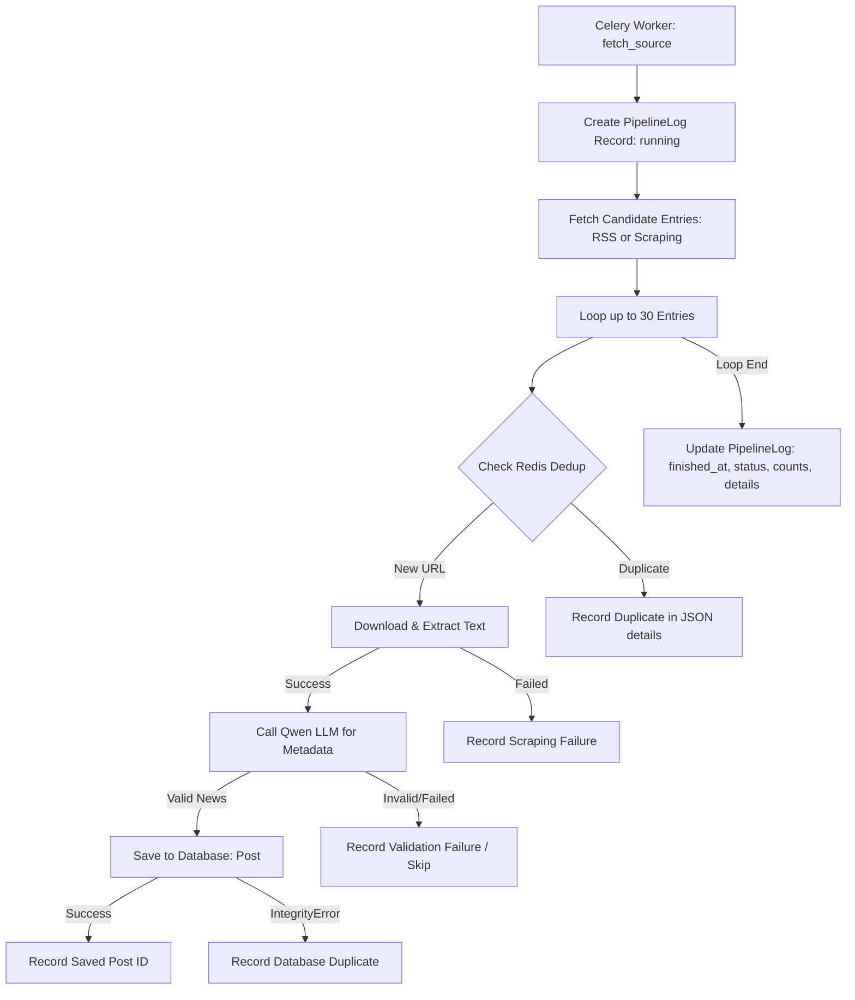

# Pipeline Logging Architecture

The pipeline logging system tracks all execution steps of the news fetching, scraping, metadata extraction, and storage pipeline. Every run of a background fetch task writes a detailed log entry in the relational database (Neon).



## Database Schema

Logs are stored in the database using the `PipelineLog` model under the `fetcher` app.

### `PipelineLog` Model

| Field | Type | Description |
| :--- | :--- | :--- |
| `id` | `BigAutoField` | Primary key |
| `source` | `ForeignKey(Source)` | The target news source being processed |
| `started_at` | `DateTimeField` | Auto-populated timestamp at start of run |
| `finished_at` | `DateTimeField` | Timestamp at completion of run |
| `status` | `CharField` | Status of the run: `running`, `success`, `partial_success`, `failed` |
| `articles_scraped` | `IntegerField` | Total number of candidate URLs discovered |
| `articles_saved` | `IntegerField` | Total number of new posts successfully added to the database |
| `error_message` | `TextField` | Global exception details if the task failed catastrophically |
| `details` | `JSONField` | Structured trace of each candidate article processed during the run |

### JSON `details` Format

The `details` JSON field stores step-by-step status and outputs for each article processed:

```json
{
  "articles": [
    {
      "url": "https://example.com/ai-article",
      "title": "Example AI Article",
      "steps": {
        "deduplication": {
          "status": "success",
          "is_new": true
        },
        "scraping": {
          "status": "success",
          "chars_extracted": 2540,
          "duration_ms": 340
        },
        "metadata_extraction": {
          "status": "success",
          "is_valid_news": true,
          "extracted_title": "Example AI Article",
          "tags": ["ai", "machine-learning"],
          "duration_ms": 1250
        },
        "storage": {
          "status": "saved",
          "post_id": 42
        }
      }
    }
  ]
}
```

## Celery Integration

Inside `apps.fetcher.tasks.fetch_source(source_id)`, a `PipelineLog` record is created before processing begins. Every step's outcome (scraping time/success, LLM verification status, saving status) is appended to a list in memory and saved to the database. Even if the task crashes or is retried, the `PipelineLog` catches the exception, updates the status to `failed` along with the traceback, and saves it before propagating the exception.
