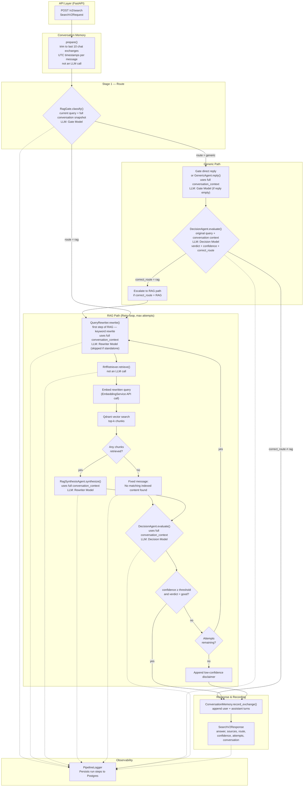
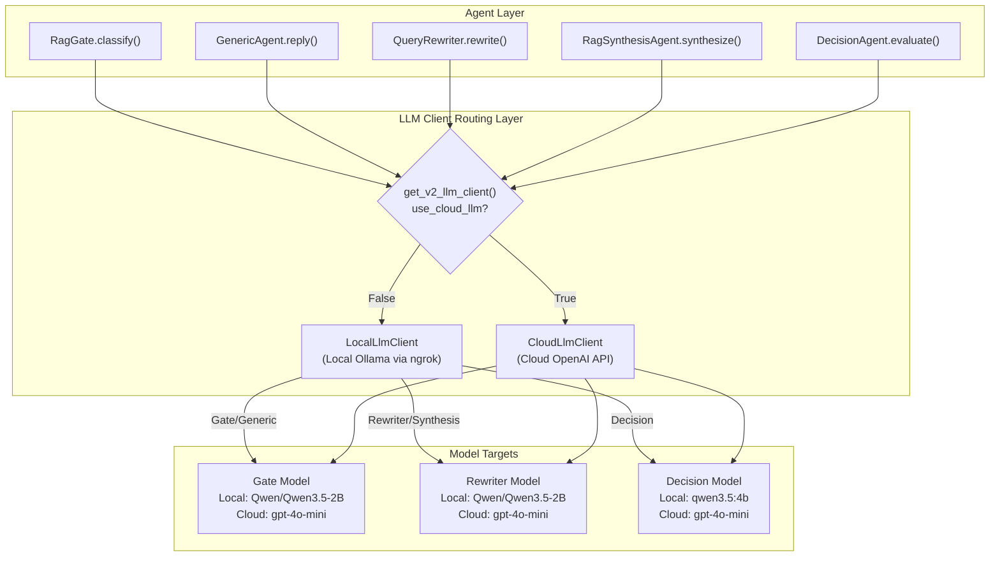
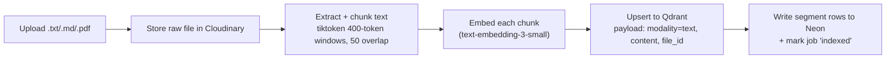
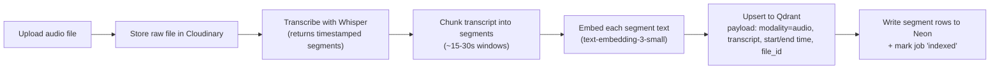
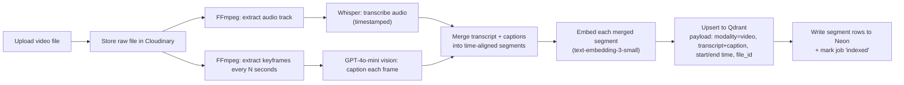
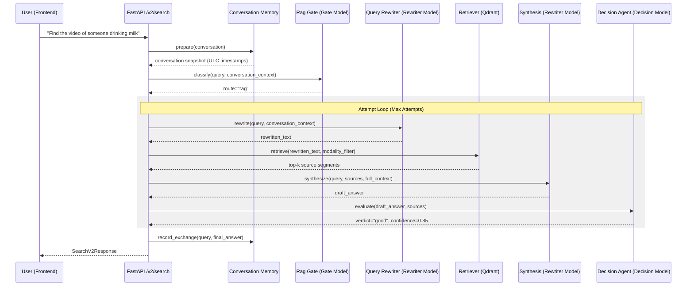

# Scrutinize

Multi-modal AI embedding and retrieval system. Upload text, audio, and video; search across all modalities with natural language.

---

## System Architecture

### 1. Overview

**Scrutinize** is a unified ingestion and retrieval system that allows users to upload **text, audio, and video**, and subsequently perform natural-language search across all modalities. The system is split into four layers:

1. **Client** — React chat-style UI (upload + search in one surface).
2. **API Layer** — FastAPI, the single entry point for the frontend, routing queries to V1 or V2 services.
3. **Processing Layer** — Async Celery workers that process raw files, extract transcriptions/captions, and generate embeddings.
4. **Data Layer** — **Qdrant** (native vector database) for similarity search, **Neon Postgres** for metadata/jobs/logs, and **Cloudinary** for raw file storage.

A local **Agentic RAG pipeline (V2)** sits on top of the data layer at query time, orchestrating query understanding, routing, multi-stage retrieval, confidence evaluation, and synthesis.

---

### 2. High-Level Architecture

The query flow is orchestrated by the `PipelineOrchestrator` (`POST /v2/search`), using local LLMs (or cloud LLMs) for agentic routing, rewriting, and validation:



#### LLM Running Placements & Client Routing Layer

Depending on the `USE_CLOUD_LLM` flag, all LLM calls are routed either locally (e.g. Qwen via Ollama) or to OpenAI:



---

### 3. Component Breakdown

| Module | Role | LLM / External dependency |
|---|---|---|
| `pipeline_orchestrator.py` | Coordinates the v2 gate → generic/decision or RAG (rewrite → retrieve → synthesis → decision) loop, error handling, and pipeline logging. | — |
| `conversation_memory.py` | Prepares and maintains a rolling snapshot of the last 10 chat exchanges with UTC timestamps. | — |
| `rag_gate.py` | Routes queries to `generic` or `rag` using the current query and full conversation snapshot; may return a direct generic reply. | Gate Model |
| `query_rewriter.py` | Enhances user query for keyword/dense search (RAG path only); incorporates correction feedback during RAG retries. | Rewriter Model |
| `generic_agent.py` | Generates a fallback conversational reply when the gate routes to `generic` without providing a reply. | Gate Model |
| `rrf_retriever.py` | Orchestrates query embedding and retrieves top-k matching documents from Qdrant. | Qdrant + Embedding Service |
| `rag_synthesis_agent.py` | Produces a cited, grounded, context-aware answer from retrieved segments. | Rewriter Model |
| `decision_agent.py` | Evaluates drafts for confidence and alignment; triggers retry feedback or escalates generic routes to RAG. | Decision Model |
| `pipeline_logger.py` | Writes steps (gate, rewrite, retrieval, synthesis, evaluation) to Neon Postgres for traceability. | Neon Postgres |
| `llm_clients/base.py` | Abstract base class for the LLM execution client | — |
| `llm_clients/local.py` | OpenAI-compatible HTTP client for local model host (ngrok/Ollama) | Local Ollama |
| `llm_clients/cloud.py` | OpenAI API client for cloud model host | OpenAI |

---

### 4. Tech Stack & Rationale

Here is how each technology operates within the pipeline and why it was selected:

* **FastAPI (Backend App)**: Hosts the `/v2/search` endpoints and orchestrates dependency injection (e.g., database sessions, clients, and pipeline components). Native asynchronous programming allows high-throughput handling of non-blocking I/O tasks.
* **Qdrant (Vector Database)**: Holds text and media embeddings (1536 dimensions) mapped to payloads containing document IDs, modality types (`text`, `audio`, `video`), text contents, and timestamps. Offers rapid approximate nearest neighbor (ANN) search and payload-based metadata filtering.
* **Neon Postgres (Relational DB & Observability)**: Serves as the database for relational schemas (files, processing jobs, segments) and houses `PipelineLogger` tables to track the multi-stage execution logs.
* **Cloudinary (Object Storage)**: Holds the raw media files (source PDFs, MP3s, MP4s) and returns CDN-backed HTTPS URLs, supporting byte-range seek for media playback.
* **Redis + Celery (Task Queue)**: Decouples slow files upload processing tasks (such as keyframe extraction, Whisper transcribing, and embedding generation) from request-response cycles.
* **Local LLM Client via Ngrok / Ollama (Agent Intelligence)**: Routes API completion payloads via `local_llm_client.py` to OpenAI-compatible local model servers, allowing offline/private model hosting.

---

### 5. Data Flows

#### Ingestion — Text


#### Ingestion — Audio


#### Ingestion — Video


#### Query / Search (v2 Pipeline)


---

### 6. Embedding & Search Strategy (and how it scales up)

#### Phase A — MVP: **Hybrid Search (Dense + Sparse/BM25)**
Every piece of content — raw text, audio transcripts, and video (transcript + frame captions) — is converted to **text** and indexed using both:
1. **Dense Vector**: `text-embedding-3-small` (1536 dimensions) for semantic retrieval.
2. **Sparse Vector**: Local `fastembed` BM25 representation for exact lexical/keyword matching.

Retrieval runs both queries concurrently using Qdrant's `Prefetch` API and merges the rankings natively using **Reciprocal Rank Fusion (RRF)**.
* Cross-modal search works seamlessly because both modalities live in the same collection.

#### Phase B — Enhancement: **native multi-vector points**
Once Phase A works end-to-end, add a **third named vector** per Qdrant point:
* `visual_vector` — CLIP image embedding of representative video keyframes, for true visual similarity search (independent of caption quality).
* `audio_vector` — CLAP (Contrastive Language-Audio Pretraining) embedding for content-based audio similarity.

Qdrant's named-vector support allows this to be an **additive** schema change without migrating existing `text_vector` or `sparse_vector` data.

---

### 7. Vector DB Schema (Qdrant)

**Collection:** `segments`

| Field | Type | Notes |
|---|---|---|
| `id` (point id) | UUID | matches `segments.id` in Neon Postgres |
| vector: `text_vector` | float[1536] | `text-embedding-3-small`, cosine distance |
| vector: `sparse_vector` | struct | `fastembed` BM25 (indices & values) for lexical search |
| payload.`file_id` | UUID | FK to Neon `files.id` |
| payload.`modality` | enum: `text` \| `audio` \| `video` | used for filtered search |
| payload.`content` | string | the transcript / caption / text chunk that was embedded |
| payload.`start_time` | float \| null | seconds, null for plain text |
| payload.`end_time` | float \| null | seconds, null for plain text |
| payload.`source_path` | string | Storage path/URL for playback |
| payload.`title` | string | original filename / display title |
| payload.`created_at` | datetime | for recency sorting/filtering |

---

### 8. Relational Schema (Neon Postgres)

```sql
-- Uploaded source files
create table files (
  id uuid primary key default gen_random_uuid(),
  filename text not null,
  modality text not null check (modality in ('text','audio','video')),
  storage_path text not null,
  duration_seconds numeric,           -- null for text
  size_bytes bigint,
  status text not null default 'uploaded'
    check (status in ('uploaded','processing','indexed','failed')),
  uploaded_at timestamptz not null default now()
);

-- Background processing jobs (one or more per file, per stage)
create table processing_jobs (
  id uuid primary key default gen_random_uuid(),
  file_id uuid not null references files(id) on delete cascade,
  stage text not null,                -- e.g. 'transcription','captioning','embedding'
  status text not null default 'pending'
    check (status in ('pending','running','done','failed')),
  error_message text,
  created_at timestamptz not null default now(),
  updated_at timestamptz not null default now()
);

-- Mirrors the Qdrant payload for relational querying/joins
create table segments (
  id uuid primary key default gen_random_uuid(),   -- == Qdrant point id
  file_id uuid not null references files(id) on delete cascade,
  modality text not null,
  content text not null,
  start_time numeric,
  end_time numeric,
  created_at timestamptz not null default now()
);

create index on segments (file_id);
create index on processing_jobs (file_id, status);
```

---

### 9. Non-Functional Considerations

* **Security**: API keys stay server-side only. File size validation is enforced at the API layer.
* **Cost Control**: Cache embeddings by content hash to prevent duplicate embedding requests; batch calls where possible.
* **Observability**: `PipelineLogger` stores step details in Postgres, making it simple to inspect why a specific query took a generic or RAG path, or why it failed evaluation.

---

### 10. Testing & CI/CD

Scrutinize uses **pytest** with marker-based test tiers:

| Tier | Location | Scope | CI job |
|---|---|---|---|
| **Unit** | `tests/unit/` | Pure logic — chunking, local LLM client parsing, memory formatting, utility checks. | `unit-tests` |
| **Integration** | `tests/integration/` | Real database connections, Redis, and Qdrant queries. Mocked LLMs where billing/network limits apply. | `integration-tests` |
| **System** | `tests/system/` | End-to-end flow from upload -> Celery worker -> Qdrant index -> V2 search query. | `system-tests` |

---

## Quick Start

1. Create a [Neon](https://neon.tech) project and copy the **pooled** connection string.

2. Set up [Cloudinary](docs/runbooks/cloudinary-setup.md) and copy credentials into `.env`:

   ```bash
   cp .env.example .env
   # Edit .env — Neon DATABASE_URL + Cloudinary credentials
   ```

3. Apply the database schema to Neon:

   ```bash
   make install-backend
   make db-migrate
   ```

4. Start backend services (Redis, Qdrant, backend, worker):

   ```bash
   docker compose up --build
   ```

5. In a second terminal, start the frontend dev server (Vite HMR):

   ```bash
   make install-frontend   # first time only
   make frontend-dev
   ```

6. Open the app:

   - Frontend: http://localhost:5173
   - API docs: http://localhost:8000/docs
   - Health: http://localhost:8000/health

The frontend shows a green **API connected** badge when `/health` reports all dependencies are reachable.

---

## Local Development (without Docker)

### Backend

```bash
cd backend
pip install -e ".[dev]"
# Ensure .env has Neon DATABASE_URL and Cloudinary credentials
uvicorn app.main:app --reload --port 8000
```

Start Redis and Qdrant separately (or use `docker compose up redis qdrant`).

### Worker

```bash
cd backend
celery -A app.workers.celery_app worker --loglevel=info
```

### Frontend

```bash
cd frontend
npm install
npm run dev
```

---

## Running Tests

```bash
make install-backend
make test-unit
make test-integration
```

See `docs/plan.md` for the full test tier breakdown.

---

## Documentation

- [Architecture](docs/architecture/architecture.md)
- [Project plan](docs/plan.md)
- [Modules](docs/modules/README.md)
- [Runbooks](docs/runbooks/README.md)
- [Database schema](docs/db/schema_doc.md)

---

## Environment Variables

| Variable | Description |
|---|---|
| `DATABASE_URL` | **Required.** Neon Postgres connection string (`postgresql+psycopg://…?sslmode=require`) |
| `REDIS_URL` | Redis broker for Celery |
| `QDRANT_URL` | Qdrant HTTP API base URL |
| `OPENAI_API_KEY` | OpenAI API key (Phase 1+) |
| `CLOUDINARY_CLOUD_NAME` | Cloudinary cloud name |
| `CLOUDINARY_API_KEY` | Cloudinary API key |
| `CLOUDINARY_API_SECRET` | Cloudinary API secret |
| `CLOUDINARY_FOLDER` | Upload folder prefix (default `scrutinize`) |
| `VITE_API_URL` | Backend URL consumed by the frontend |

---

## GitHub Actions Secrets

For integration/system CI jobs, configure:

- `DATABASE_URL` — Neon pooled connection string
- `CLOUDINARY_CLOUD_NAME`, `CLOUDINARY_API_KEY`, `CLOUDINARY_API_SECRET`
- `OPENAI_API_KEY` — as needed for Phase 1+


services:
  redis:
    image: redis:7-alpine
    ports:
      - "6379:6379"
    healthcheck:
      test: ["CMD", "redis-cli", "ping"]
      interval: 5s
      timeout: 5s
      retries: 10

  qdrant:
    # Keep this in sync with qdrant-client in backend/pyproject.toml (currently 1.17–1.18).
    # If Qdrant exits with "unknown variant on_disk", the volume was written by a newer
    # image than the one running — run: make reset-qdrant && make up
    image: qdrant/qdrant:v1.18.2
    ports:
      - "6333:6333"
    volumes:
      - qdrant_data:/qdrant/storage
    healthcheck:
      test: ["CMD-SHELL", "bash -c 'exec 3<>/dev/tcp/127.0.0.1/6333'"]
      interval: 5s
      timeout: 5s
      retries: 10

  backend:
    build: ./backend
    ports:
      - "8000:8000"
    volumes:
      - ./backend:/app
    env_file:
      - backend/.env
    environment:
      REDIS_URL: redis://redis:6379/0
      QDRANT_URL: http://qdrant:6333
    depends_on:
      redis:
        condition: service_healthy
      qdrant:
        condition: service_healthy
    healthcheck:
      test: ["CMD", "curl", "-f", "http://localhost:8000/health"]
      interval: 10s
      timeout: 5s
      retries: 10
      start_period: 20s

  worker:
    build: ./backend
    command: celery -A app.workers.celery_app worker --loglevel=info
    volumes:
      - ./backend:/app
    env_file:
      - backend/.env
    environment:
      REDIS_URL: redis://redis:6379/0
      QDRANT_URL: http://qdrant:6333
    depends_on:
      redis:
        condition: service_healthy
      backend:
        condition: service_healthy

volumes:
  qdrant_data:


.PHONY: help up down logs infra-up infra-down reset-qdrant backend-shell backend-dev worker-dev v2-dev v2-health \
	db-migrate test test-unit test-integration test-system test-security lint install-backend install-frontend frontend-dev

# Scrutinize — common dev commands (Windows: use Git Bash or WSL for `make`)

help:
	@echo "Scrutinize dev commands"
	@echo ""
	@echo "  Full stack (Docker):     make up"
	@echo "  v2 local backend:        make v2-dev          (infra + guide; then backend-dev in another terminal)"
	@echo "  Backend only (reload):   make backend-dev"
	@echo "  Check Qdrant + .env:     make check-qdrant"
	@echo "  Celery worker:           make worker-dev  (restart after .env changes!)"
	@echo "  Frontend (Vite):         make frontend-dev"
	@echo "  Redis + Qdrant only:     make infra-up   (qdrant always; redis skipped if port 6379 busy)"
	@echo "  Qdrant only:             make infra-qdrant"
	@echo "  Check v2 LLM:            make v2-health"
	@echo ""
	@echo "v2 uses the same FastAPI app — search hits POST /v2/search (frontend: VITE_SEARCH_API=/v2/search)."

# --- Docker full stack ---

up:
	docker compose up

up-build:
	docker compose up --build

build:
	docker compose build

down:
	docker compose down -v

infra-up:
	docker compose up -d qdrant
	-docker compose up -d redis

infra-qdrant:
	docker compose up -d qdrant

infra-down:
	docker compose stop redis qdrant

reset-qdrant:
	docker compose down -v
	docker compose pull qdrant

logs:
	docker compose logs -f

backend-shell:
	docker compose exec backend bash

# --- Local backend (v1 + v2 routes on same server) ---

backend-dev:
	cd backend && uvicorn app.main:app --reload --host 0.0.0.0 --port 8000

worker-dev:
	cd backend && celery -A app.workers.celery_app worker --loglevel=info --pool=solo

check-config:
	cd backend && python scripts/print_config.py

check-qdrant: check-config

# Start infra, then print what to run next for v2 (local Qwen pipeline).
v2-dev: infra-up
	@echo ""
	@echo "=== v2 backend dev ==="
	@echo "1. Ensure backend/.env has:"
	@echo "     REDIS_URL=redis://localhost:6379/0"
	@echo "     LOCAL_LLM_BASE_URL=https://YOUR-NGROK-HOST/api/generate"
	@echo "   For search-only (no uploads): CELERY_TASK_ALWAYS_EAGER=true"
	@echo "   For uploads: keep Redis running + run 'make worker-dev' in another terminal."
	@echo ""
	@echo "2. Terminal A:  make backend-dev"
	@echo "3. Terminal B:  make frontend-dev   (uses /v2/search by default)"
	@echo "4. Optional:    make worker-dev      (file ingestion; uses --pool=solo on Windows)"
	@echo ""
	@echo "API:  http://localhost:8000/docs"
	@echo "v2:   POST /v2/search   GET /v2/llm-health"

v2-health:
	curl -s http://localhost:8000/v2/llm-health

# --- DB / scripts ---

db-migrate:
	cd backend && python scripts/apply_migrations.py

cloudinary-smoke:
	cd backend && python scripts/cloudinary_smoke.py

check-ffmpeg:
	cd backend && python scripts/check_ffmpeg.py

check-text-ingestion:
	cd backend && python scripts/check_text_ingestion.py $(FILE)

check-audio-ingestion:
	cd backend && python scripts/check_audio_ingestion.py $(FILE)

check-video-ingestion:
	cd backend && python scripts/check_video_ingestion.py $(FILE)

check-search:
	cd backend && python scripts/check_search.py $(QUERY)

install-backend:
	cd backend && pip install -e ".[dev]"

install-frontend:
	cd frontend && npm install

# --- Tests / lint ---

test:
	pytest tests -v

test-unit:
	pytest tests/unit -m unit -v

test-integration:
	pytest tests/integration -m integration -v

test-system:
	pytest tests/system -m system -v

test-security:
	pytest tests/security -m security -v

lint:
	cd backend && ruff check app
	cd backend && ruff format --check app

frontend-dev:
	cd frontend && npm run dev


